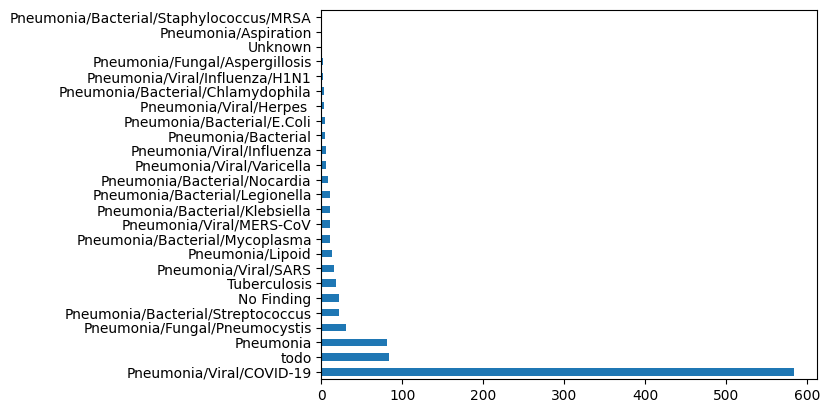
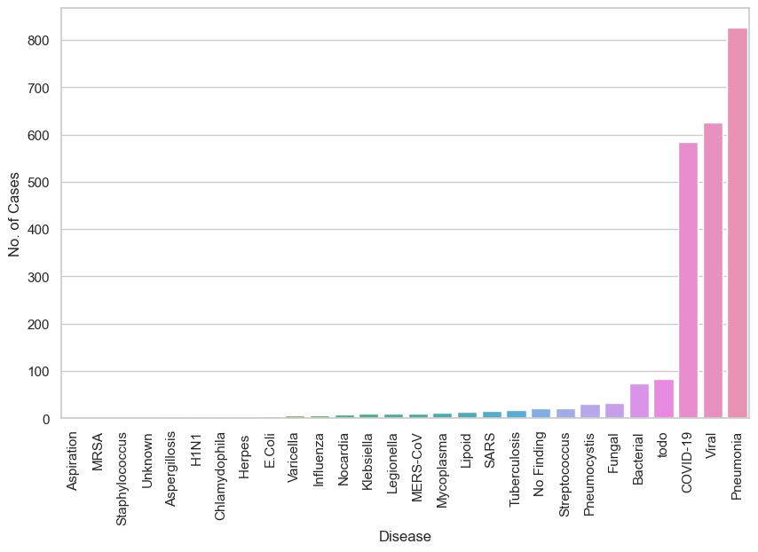

# Breathing Problem Classification using CNN

## Overview

In this Project, we use CNN on X-rays and CT scan images of various patients from across the world [Cohen, Joseph Paul, et al. "Covid-19 image data collection: Prospective predictions are the future." arXiv preprint arXiv:2006.11988 (2020).](https://arxiv.org/pdf/2003.11597.pdf) to predict various breathing diseases they. A total of 28 breathing issues are there including. We have treated the problem as a multilabel classification problem here as a single patient often have more than one disease.

## Table of Contents
+ [Overview](#overview)
+ [Table of Contents](#table-of-contents)
+ [Datasets](#datasets)
+ [Model Architecture](#model-architecture)
+ [Preprocessing](#preprocessing)
+ [Training](#training)
+ [Evaluation](#evaluation)
+ [Usage](#usage)
+ [Dependencies](#dependencies)

## Datasets

The following dataset has been used for this project : [Cohen, Joseph Paul, et al. "Covid-19 image data collection: Prospective predictions are the future." arXiv preprint arXiv:2006.11988 (2020).](https://arxiv.org/pdf/2003.11597.pdf) which can be found [here](https://www.kaggle.com/datasets/kaggleprollc/covid-19-image-data-collection-ieee).

## Model Architecture

There are 3 models that have been initially finetuned to work directly on the images to detect diseases: `regnet_y_3_2gf`, `efficientnet_v2_s` and `swin_v2_t`. The final classification layer was changed from 1000 neurons to 28 for our task. Their architecture of their final layer after the change is as follows:

### RegNet

**Before**: (fc): Linear(in_features=1512, out_features=1000, bias=True)

**After**: (fc): Linear(in_features=1512, out_features=28, bias=True)

### EfficientNet

**Before**: (classifier): Sequential(<br>
    (0): Dropout(p=0.2, inplace=False)<br>
    (1): ReLU()<br>
    (2): Linear(in_features=1280, out_features=1000, bias=True)<br>
)

**After**: (classifier): Sequential(<br>
    (0): Dropout(p=0.2, inplace=False)<br>
    (1): ReLU()<br>
    (2): Linear(in_features=1280, out_features=28, bias=True)<br>
)

### Swinv2

**Before**: (head): Linear(in_features=768, out_features=1000, bias=True)

**After**: (head): Linear(in_features=768, out_features=28, bias=True)

## Preprocessing

The following columns were binary encoded to be used as metadata later on in the development.

```
sex unique values: ['M' 'F' nan]
After conversion unique values: [ 0.  1. nan]

RT_PCR_positive unique values: ['Y' nan 'Unclear']
After conversion unique values: [ 1. nan  0.]

survival unique values: ['Y' nan 'N']
After conversion unique values: [ 1. nan  0.]

intubated unique values: ['N' 'Y' nan]
After conversion unique values: [ 0.  1. nan]

intubation_present unique values: ['N' 'Y' nan]
After conversion unique values: [ 0.  1. nan]

went_icu unique values: ['N' 'Y' nan]
After conversion unique values: [ 0.  1. nan]

in_icu unique values: ['N' 'Y' nan]
After conversion unique values: [ 0.  1. nan]

modality unique values: ['X-ray' 'CT']
After conversion unique values: [0 1]
```

The values in the view column were onehot encoded as well

```
view unique values: ['PA' 'AP' 'L' 'Axial' 'AP Supine' 'Coronal' 'AP Erect']
After encoding columns: ['view_AP', 'view_AP Erect','view_AP Supine', 'view_Axial', 'view_Coronal', 'view_L', 'view_PA']
```

The distribution of diseases was as follows initially:



The different diseases were broken down and made it into different labels as follows:
```
'Pneumonia', 'Viral', 'COVID-19', 'SARS', 'Fungal', 'Pneumocystis', 'Bacterial', 'Streptococcus', 'No Finding', 'Chlamydophila', 'E.Coli', 'Klebsiella', 'Legionella', 'Unknown', 'Lipoid', 'Varicella', 'Mycoplasma', 'Influenza', 'todo', 'Tuberculosis', 'H1N1', 'Aspergillosis', 'Herpes ', 'Aspiration', 'Nocardia', 'MERS-CoV', 'Staphylococcus', 'MRSA'
```

The distribution after doing this became as follows:



Afterwards this multilabel data was used to train the models.

## Training

The scripts for fine-tuning the models is present in **Scripts** folder. The training loop as well as custom dataset class are present in the `utils.py` file.<br>

The models are trained using **Adam Optimizer** with learning rate set at 0.005 for the first three initial models that are trained only on images for a maximum for **100 epochs** with an early stopping rule if validation loss does not improve after **20 epochs**.

## Evaluation

## Usage

## Dependencies

All the dependencies in the project are mentioned in __requirements.txt__ file. To install all dependencies run the following command in your terminal:<br>
```
pip install -r requirements.txt
```
